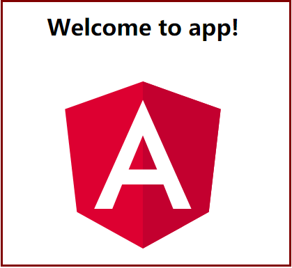

# 假设
本文假设读者已经装好了node、git、cnpm开发环境。
如果还未安装好node和cnpm请参考[node安装](/Nodejs/install.md)
# 步骤
* 安装angular cli
```
cnpm install -g @angular/cli
```
* 创建新工程

```
ng new my-app
```
* 启动应用

```
cd my-app
ng serve --open
```
如下图，启动成功：


[返回](./readme.md)
