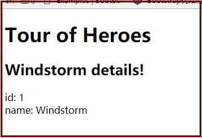
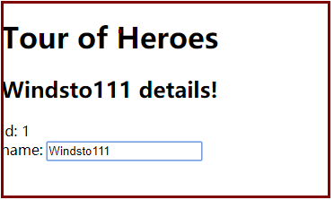

# Hero编辑器 {ignore= true}

<!-- @import "[TOC]" {cmd="toc" depthFrom=1 depthTo=6 orderedList=false} -->
<!-- code_chunk_output -->

* [前言](#前言)
* [创建启动项目](#创建启动项目)
* [显示hero](#显示hero)
* [创建HERO对象](#创建hero对象)
* [双向绑定](#双向绑定)

<!-- /code_chunk_output -->

## 前言
该例是官方列子，作者只是把该例子做一些翻译和整理，如果需要看官方原始文档，请访问：
https://angular.io/tutorial/toh-pt1

## 创建启动项目

```
ng new angular-tour-of-heroes
cd angular-tour-of-heroes
ng serve -o
```

## 显示hero
> src\app\app.component.ts
```typescript
import { Component } from '@angular/core';
@Component({
  selector: 'app-root',
  template: `<h1>{{title}}</h1><h2>{{hero}} details!</h2>`,
  styleUrls: ['./app.component.css']
})
export class AppComponent {
  title = 'Tour of Heroes';
  hero = 'Windstorm';
}
```

网页查看执行效果：


## 创建HERO对象
修改如下代码：
> src\app\app.component.ts
```typescript
import { Component } from '@angular/core';

@Component({
  selector: 'app-root',
  template: `
    <h1>{{title}}</h1>
    <h2>{{hero.name}} details!</h2>
    <div><label>id: </label>{{hero.id}}</div>
    <div><label>name: </label>{{hero.name}}</div>
    `,
  styleUrls: ['./app.component.css']
})
export class AppComponent {
  title = 'Tour of Heroes';
  hero: Hero = {
    id: 1,
    name: 'Windstorm'
  };
}
export class Hero {
  id: number;
  name: string;
}
```

网页查看执行效果如下：


## 双向绑定
>app.component.ts
```typescript
import { Component } from '@angular/core';

@Component({
  selector: 'app-root',
  template: `
    <h1>{{title}}</h1>
    <h2>{{hero.name}} details!</h2>
    <div><label>id: </label>{{hero.id}}</div>
    <div>
    <label>name: </label>
    <input [(ngModel)]="hero.name" placeholder="name">
    </div>
    `,
  styleUrls: ['./app.component.css']
})
export class AppComponent {
  title = 'Tour of Heroes';
  hero: Hero = {
    id: 1,
    name: 'Windstorm'
  };
}
export class Hero {
  id: number;
  name: string;
}
```

>app.module.ts
```typescript
import { Component } from '@angular/core';

@Component({
  selector: 'app-root',
  template: `
    <h1>{{title}}</h1>
    <h2>{{hero.name}} details!</h2>
    <div><label>id: </label>{{hero.id}}</div>
    <div>
    <label>name: </label>
    <input [(ngModel)]="hero.name" placeholder="name">
    </div>
    `,
  styleUrls: ['./app.component.css']
})
export class AppComponent {
  title = 'Tour of Heroes';
  hero: Hero = {
    id: 1,
    name: 'Windstorm'
  };
}
export class Hero {
  id: number;
  name: string;
}
```

执行效果



[返回](./readme.md)
