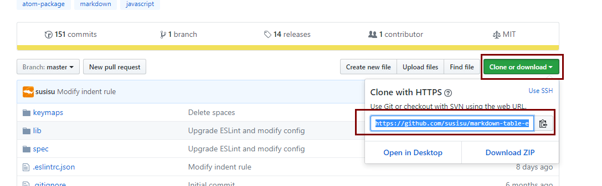
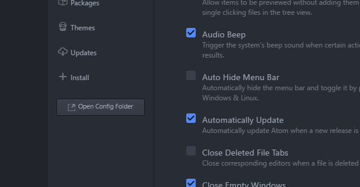
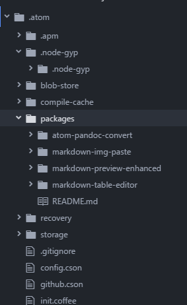

# atom的安装和使用 {ignore = true}

<!-- @import "[TOC]" {cmd="toc" depthFrom=1 depthTo=6 orderedList=false} -->
<!-- code_chunk_output -->

* [前言](#前言)
* [安装](#安装)
	* [安装环境](#安装环境)
	* [安装步骤](#安装步骤)
		* [安装Atom](#安装atom)
		* [安装packages方法](#安装packages方法)
		* [安装以下packages](#安装以下packages)
* [快捷键](#快捷键)

<!-- /code_chunk_output -->


# 前言
Atom 是github专门为程序员推出的一个跨平台文本编辑器。具有简洁和直观的图形用户界面，并有很多有趣的特点：支持CSS，HTML，JavaScript等网页编程语言。它支持宏，自动完成分屏功能，集成了文件管理器。

# 安装
## 安装环境
 * windows 10 64 位
 * 系统已经装好了git工具
 * 系统已经装好了node
 * 系统已经装好了cnpm
## 安装步骤
### 安装Atom
 在ATOM的[官网](https://atom.io/)下载安装包,按点击安装文件。

 

### 安装packages方法
  * 在ATOM官网(https://atom.io/packages)上查找希望安装的包，如：markdown-table-editor,点击对应插件:

  
  
  * 如下图找到github上插件对应地址，复制该地址，备用。

  
  * 打开atom,快捷键`ctrl-,`,点击`Open Config Folder`

  
  * 右键盘packages -> Show in Explorer

  
  * 进入packages文件夹，打开git 命令行工具
  * 输入命令
  ```
  git clone https://github.com/susisu/markdown-table-editor.git
  cd  markdown-table-editor
  cnpm install
  ```
  * 重启atom 安装成功

### 安装以下packages
 我们安装的常用packages如下：

| 包名                        | 下载地址                                                       |
|---------------------------|------------------------------------------------------------|
| markdown-table-editor     | https://github.com/susisu/markdown-table-editor.git        |
| atom-pandoc-convert       | https://github.com/josa42/atom-pandoc-convert.git          |
| markdown-img-paste        | https://github.com/cocoakekeyu/markdown-img-paste.git      |
| markdown-preview-enhanced | https://github.com/shd101wyy/markdown-preview-enhanced.git |

# 快捷键
| 命令             | 作用    |
|----------------|-------|
| contrl-shift+p | 命令列表  |
| contrl-,       | IDE设置 |


 [返回](/readme.md)
