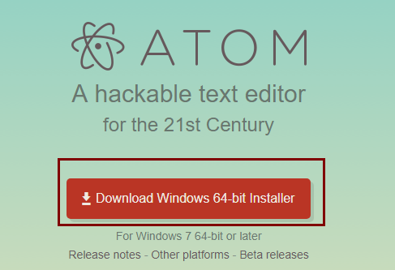
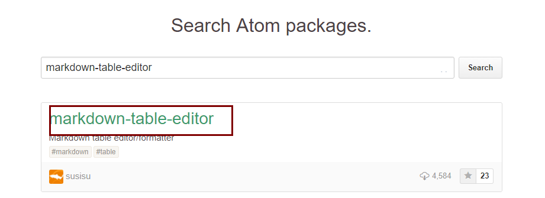
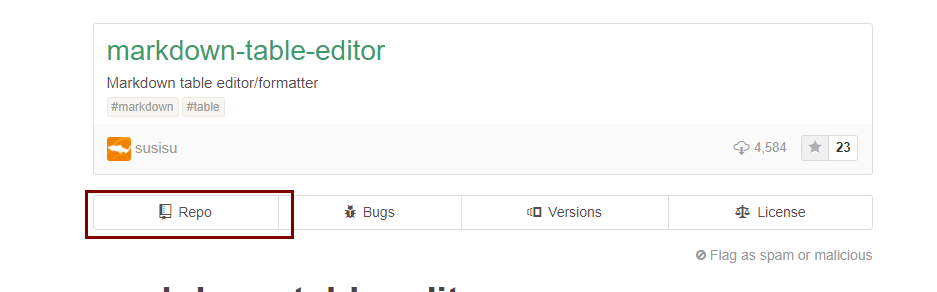
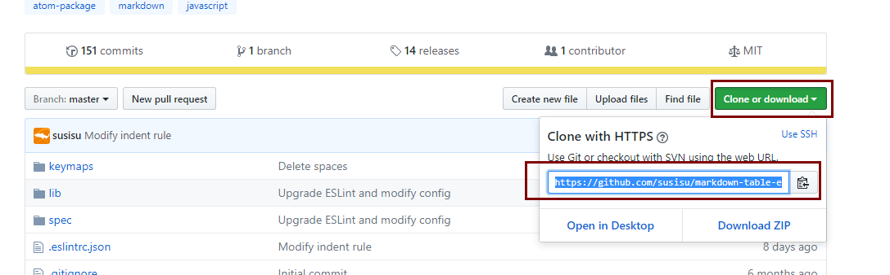
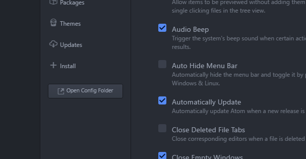
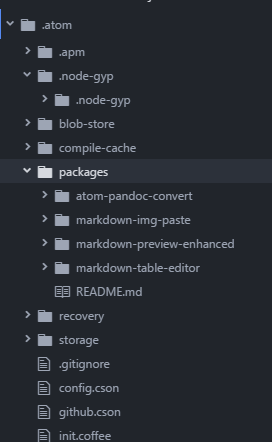

# 安装Atom

<!-- @import "[TOC]" {cmd="toc" depthFrom=1 depthTo=6 orderedList=false} -->
<!-- code_chunk_output -->

* [安装Atom](#安装atom)
	* [安装环境](#安装环境)
	* [安装步骤](#安装步骤)
		* [安装Atom](#安装atom-1)
		* [安装packages方法](#安装packages方法)
		* [安装packages](#安装packages)
	* [返回首页](#返回首页readmemd)

<!-- /code_chunk_output -->


## 安装环境
 * windows 10 64 位
 * 系统已经装好了git工具
 * 系统已经装好了node
 * 系统已经装好了cnpm
## 安装步骤
### 安装Atom
 在ATOM的[官网](https://atom.io/)下载安装包,按点击安装文件。
 

### 安装packages方法
  1. 在ATOM官网(https://atom.io/packages)上查找希望安装的包，如：markdown-table-editor,点击对应插件:
  
  
  2. 如下图找到github上插件对应地址，复制该地址，备用。
  
  1. 打开atom,快捷键`ctrl-,`,点击`Open Config Folder`
  
  1. 右键盘packages -> Show in Explorer
  
  1. 进入packages文件夹，打开git 命令行工具
  1. 输入命令
  ```
  git clone https://github.com/susisu/markdown-table-editor.git
  cd  markdown-table-editor
  cnpm install
  ```
  1. 重启atom 安装成功


### 使用上一章办法安装以下packages
 我们安装的常用packages如下：

|           包名            |                          下载地址                          |
| ------------------------- | ---------------------------------------------------------- |
| markdown-table-editor     | https://github.com/susisu/markdown-table-editor.git        |
| atom-pandoc-convert       | https://github.com/josa42/atom-pandoc-convert.git          |
| markdown-img-paste        | https://github.com/cocoakekeyu/markdown-img-paste.git      |
| markdown-preview-enhanced | https://github.com/shd101wyy/markdown-preview-enhanced.git |


注：可以在https://atom.io/packages 地址查找常用的包。

## [返回首页](/readme.md)
