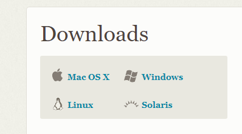

---
<!-- @import "[TOC]" {cmd="toc" depthFrom=1 depthTo=6 orderedList=false} -->
<!-- code_chunk_output -->

* [安装](#安装)
* [常用命令](#常用命令)
* [常用组合操作](#常用组合操作)
	* [从命令行创建一个新的仓库](#从命令行创建一个新的仓库)
	* [从命令行推送已经创建的仓库](#从命令行推送已经创建的仓库)

<!-- /code_chunk_output -->
---
# 安装
[官网](https://git-scm.com/downloads)下载安装。如果是在windows下安装，请选择安装LINUX命令，这将对你以后的研发很有帮助。

# 常用命令

|                命令                 |           说明           |
| ----------------------------------- | ------------------------ |
| git init                            | 初始化仓库               |
| git add .                           | 添加新文件或者更改新文件 |
| git add filename                    | 添加一个文件             |
| git commit -m "comment"             | 提交文件到本地           |
| git remote                          | 列出已经存在的远程分支   |
| git remote remove <name>            | 删除远程分支             |
| git clone https://url/testTitle.git | 克隆到本地               |
| git fetch branch2                   | 更新信息                 |
| git merge branch2/master            | merge本地信息            |
| git remove  **                      | 删除文件                 |
| git push                            | push到服务器上           |
| git pull origin master              | 从服务器上拉取信息       |
| git branch -a                       | 查看所有分支             |
| git branch -r                       | 查看远程分支             |
| git branch -d ***                   | 删除分支                 |
| git branch  ***                     | 新建分支                 |
| git checkout ***                    | 切换分支                 |
| git status                          | 查看状态                 |
| git log                             | 查看提交修改记录         |

#常用组合操作

## 从命令行创建一个新的仓库
touch README.md
git init
git add README.md
git commit -m "first commit"
git remote add origin https://try.gogs.io/qiujiahongd/test.git
git push -u origin master

## 从命令行推送已经创建的仓库
git remote add origin https://try.gogs.io/qiujiahongd/test.git
git push -u origin master
